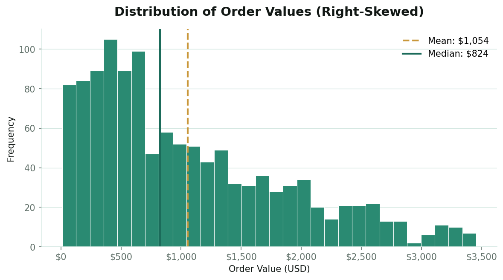
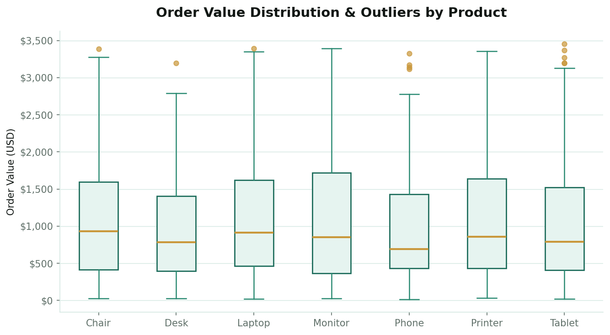
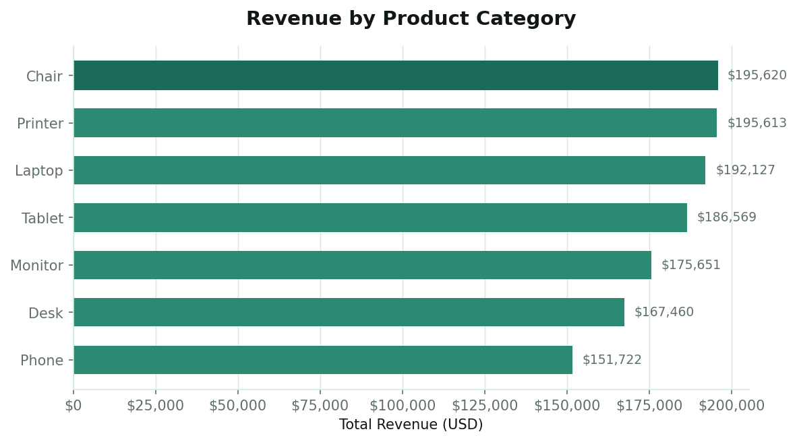
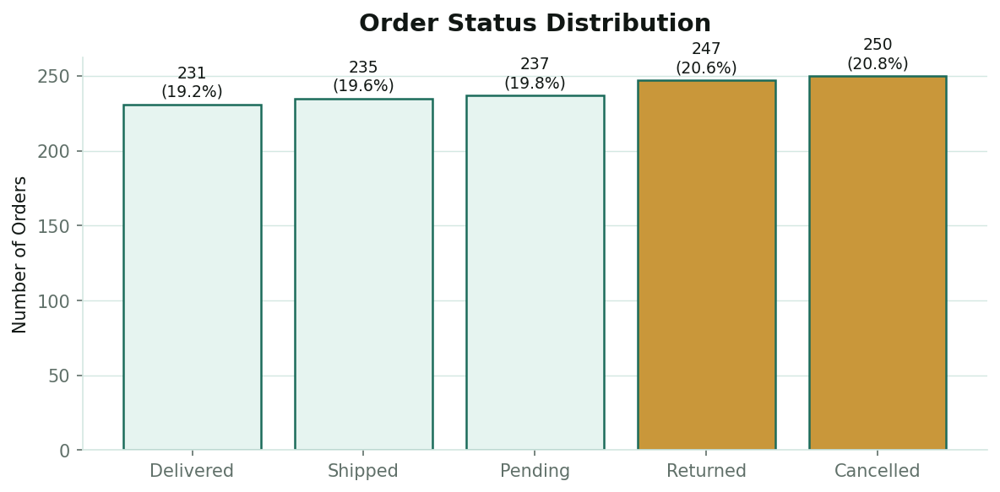
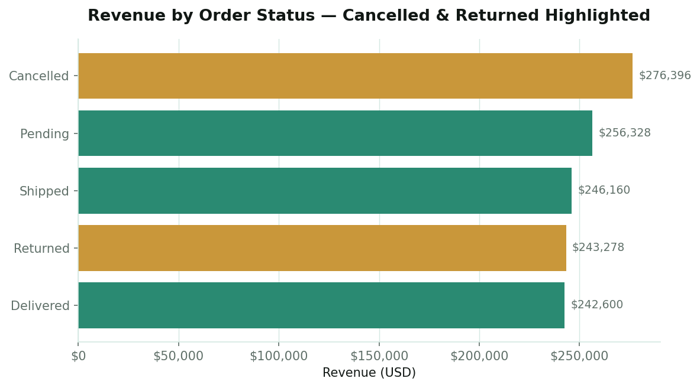
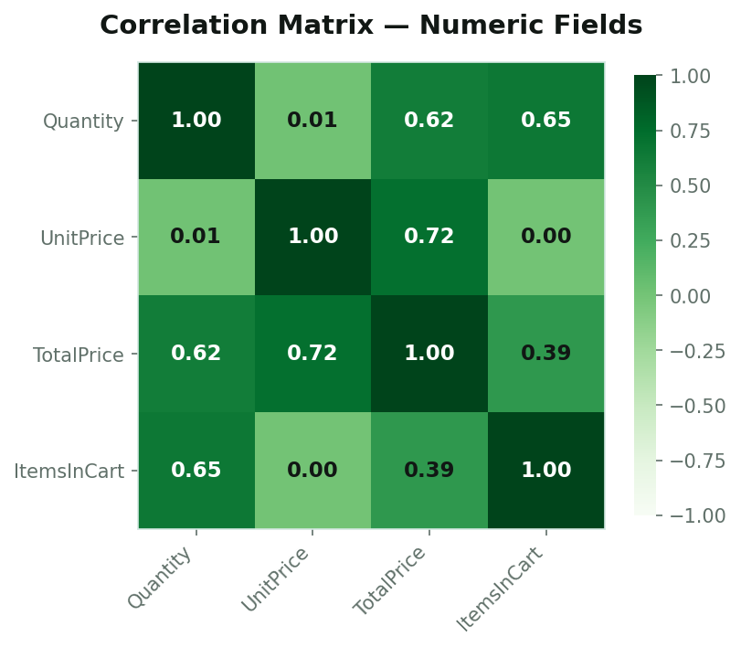
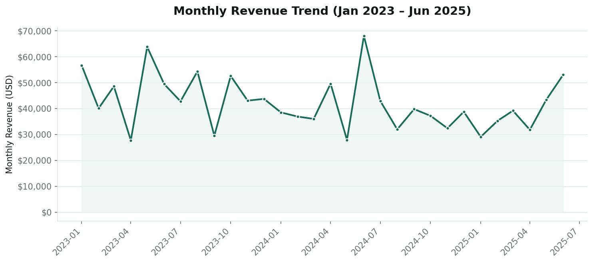

# Project 2: Exploratory Data Analysis (EDA) — E-Commerce Orders

**Role:** Data Analyst (Industrial Training Kit, DecodeLabs — Batch 2026)
**Tools:** Excel, Python (pandas, matplotlib)
**Dataset:** 1,200 cleaned e-commerce orders, 14 columns (Jan 2023 – Jun 2025)
**Builds on:** [Project 1 — Data Cleaning & Preparation](../data-cleaning-ecommerce-orders)

---

## 1. Problem Statement

What patterns, trends, and outliers exist in the cleaned DecodeLabs orders dataset, and what do they reveal about product performance, customer behaviour, and order fulfilment that the business should act on?

This project picks up where Project 1 left off: rather than re-cleaning the data, it interrogates the *already-clean* dataset to uncover the story behind the numbers — following an EDA framework of descriptive statistics, outlier detection, segmentation, and correlation analysis.

---

## 2. Methodology

- Built on the Project 1 cleaned dataset (1,200 rows, 0 duplicates, ISO dates, 2-decimal pricing)
- Computed five-number summaries (min, Q1, median, Q3, max) for `Quantity`, `UnitPrice`, `TotalPrice`, and `ItemsInCart`
- Compared mean vs. median across all numeric fields to detect skew
- Applied two outlier-detection methods to `TotalPrice` and `UnitPrice`:
  - **IQR method** (flag values beyond Q1 − 1.5×IQR or Q3 + 1.5×IQR)
  - **Z-score method** (flag |z| > 3)
- Segmented revenue and order counts by `Product`, `OrderStatus`, `PaymentMethod`, `ReferralSource`, and `CouponCode`
- Built a Pearson correlation matrix across all numeric fields
- Analysed the monthly revenue trend (Jan 2023 – Jun 2025) and day-of-week ordering patterns

---

## 3. Key Findings

### Order values are right-skewed
Mean order value (**$1,053.97**) sits well above the median (**$823.62**), with a skewness of **0.89**. A small number of large bulk orders pull the average upward — the median is the more representative "typical order."

### The 8 high-value "outliers" are signal, not noise
The IQR method flags 8 orders above $3,330. All 8 share `Quantity = 5` (the dataset's maximum) on high-priced items (Laptops, Tablets, Monitors, Printers). The Z-score method finds **0** statistical outliers (|z| ≤ 3) — these are legitimate bulk orders, not data-entry errors. No records were removed.

### Revenue is broadly even across products
Chair ($195,620), Printer ($195,613), and Laptop ($192,127) lead; Phone trails at $151,722. The spread across all 7 categories is within ~22% of each other — no single product dominates.

### 41% of revenue is tied up in Cancelled/Returned orders
Of $1,264,762 in total order value, **$519,674 (41.1%)** sits in Cancelled or Returned status. Cancelled orders alone ($276,396) represent the single largest status-revenue bucket — larger than Delivered.

### Cancel/return rates are consistent across products (~39–44%)
Monitor (43.6%) and Tablet (43.0%) have the highest combined cancel/return rates; Desk (39.4%) and Phone (39.7%) the lowest. The ~5-point spread suggests this is a **systemic fulfilment issue**, not a product-specific one.

### Online payments have the lowest cancel/return rate
Online (35.3%) is notably lower than Gift Card (44.3%), Credit Card (44.0%), and Cash (43.1%) — worth investigating what differs in the online checkout/fulfilment flow.

### TotalPrice correlates strongly with UnitPrice and Quantity
As expected — TotalPrice is derived from these fields (r = 0.72 and r = 0.62 respectively). `ItemsInCart` correlates with `Quantity` (r = 0.65) but only weakly with `TotalPrice` (r = 0.39), suggesting cart size doesn't strongly predict order value.

### Coupon usage is widespread but doesn't clearly lift order value
74.25% of orders (891/1,200) used a coupon. Orders with a coupon averaged $1,057.64 vs. $1,043.37 without — a negligible ~1.4% difference, suggesting coupons may not be driving larger basket sizes.

### No strong seasonality, but 2023 outperformed 2024 and 2025 (YTD)
2023 generated $552,643 across 510 orders; 2024 fell to $480,236 (459 orders); 2025 (Jan–Jun only) is on pace for a similar run-rate (~$464K annualised) to 2024.

---

## 4. Recommendations

1. **Investigate the 41% cancel/return rate as the #1 priority** — recovering even half of the $519,674 at-risk revenue would be a 20%+ uplift on total order value.
2. **Study what makes Online payments outperform other methods on cancel/return rate** (35.3% vs ~43–44%) and apply those learnings (checkout flow, confirmation steps, fraud checks) to other payment types.
3. **Treat the 8 large bulk orders (Qty = 5) as VIP/high-value customer signals** — flag for account management rather than excluding as "outliers."
4. **Re-evaluate coupon strategy** — with only a ~1.4% lift in average order value across 891 coupon-using orders, the current coupon mix may be subsidising orders that would have happened anyway.
5. **Use the median ($823.62), not the mean**, when reporting a "typical order value" to stakeholders — the right-skewed distribution makes the mean misleading for everyday business reporting.

---

## 📂 Deliverables

- **[DecodeLabs_Project2_EDA.xlsx](./DecodeLabs_Project2_EDA.xlsx)** — Excel workbook containing:
  - `Executive Summary` — Problem statement, methodology, key findings, and recommendations
  - `Descriptive Stats` — Five-number summaries and mean-vs-median skew diagnosis
  - `Outlier Analysis` — IQR & Z-score outlier detection with verdicts
  - `Business Breakdowns` — Revenue/orders segmented by product, status, payment method, referral source, coupon, and day of week
  - `Correlation Matrix` — Pearson correlations with interpretation
  - `Visual Evidence` — All 7 charts embedded
  - `Cleaned Data` — The underlying 1,200-row dataset (carried forward from Project 1)
- The 7 chart PNGs above are also included in this repo as standalone image files

---

## 💡 Key Takeaways

- **An outlier isn't automatically an error.** Statistical flags (IQR) need a second check (Z-score, business context) before deciding whether to investigate, keep, or remove — these 8 "outliers" turned out to be the dataset's most valuable customers.
- **The mean can lie.** A right-skewed distribution makes the average order value ($1,054) overstate what a "typical" customer spends ($824) — reporting the wrong central tendency can mislead stakeholders.
- **EDA's real value is in the "so what."** The most actionable finding wasn't a statistic — it was translating "41% of orders are cancelled or returned" into "$519,674 in at-risk revenue," which gives leadership a number worth acting on.
